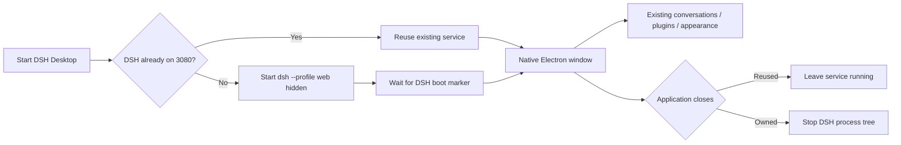

<div align="center">
  

# DSH Desktop

A lightweight Windows shell for the DeepSeek Harness WebUI

[中文](README.md) · [Install](#install) · [Architecture](#architecture) · [Troubleshooting](#troubleshooting)

[](LICENSE)
[](#requirements)
[](https://www.electronjs.org/)
</div>

DSH Desktop places the local DeepSeek Harness WebUI in a dedicated native window. It connects to or starts `dsh --profile web`, and it stops only a backend that it owns. Because it does not duplicate the chat frontend or configuration store, browser and desktop access share the same workspaces, conversations, plugins, model settings, and appearance theme.

> [!IMPORTANT]
> This is a community-maintained wrapper, not an official DeepSeek desktop client.


> The documentation image uses generic placeholders and contains no real workspace, path, or conversation data. The application loads your actual local DSH WebUI.

### Startup state


The local state page appears only while connecting or after a startup failure. Once DSH is ready, the same window switches to the WebUI. On failure, it keeps bounded diagnostics visible without opening a console or changing configuration.

## Highlights

- Validates and reuses an existing DSH WebUI on `127.0.0.1:3080`.
- Starts the Windows backend with `windowsHide`, so no CMD window appears.
- Uses a single application instance and focuses the existing window on a second launch.
- Stops only the DSH process tree created by this desktop instance.
- Uses one app icon for the executable, installer, shortcuts, window, and documentation.
- Keeps the WebUI as the only conversation/configuration frontend.
- Checks GitHub Releases once after the WebUI is ready and prompts only for a newer stable version; it never downloads or executes an installer automatically.
- Enables context isolation and renderer sandboxing, disables Node integration, and sends external links to the system browser.
- Keeps a polished local startup page open with bounded diagnostics when DSH cannot start.

## Requirements

- Windows 10/11 x64.
- Node.js `22.19+` or `24+`, as required by DeepSeek Harness.
- DeepSeek Harness installed with `dsh --version` working in a fresh PowerShell.
- The default Web profile and `http://127.0.0.1:3080` endpoint.

DSH Desktop does not bundle Node, model credentials, or a DSH home. It uses your existing installation and `$DSH_HOME` without copying conversations.

## Install

Download `DSH-Desktop-Setup-<version>.exe` from [Releases](https://github.com/Zhen-WushuiLingchun/dsh-desktop-GUI/releases). The NSIS installer supports a custom installation directory and creates desktop and Start menu shortcuts.

Community builds are currently unsigned, so Windows SmartScreen may show an unknown-publisher warning. Download only from this repository's release page.

Run from source:

```powershell
git clone https://github.com/Zhen-WushuiLingchun/dsh-desktop-GUI.git
cd dsh-desktop-GUI
pnpm install
pnpm start
```

## Architecture



The desktop-specific surface is intentionally small:

```text
src/main.js         probing, hidden launch, ownership, windowing, safe navigation
src/update.js       GitHub Release query and semantic version comparison
src/startup.html    startup and bounded error state matching the WebUI palette
assets/app-icon.png shared executable, installer, shortcut, window, and README icon
```

## Appearance persistence

DSH Desktop does not store themes. The `dsh-easy-appearance` plugin persists colors, wallpaper, opacity, fonts, and custom CSS through DSH Host settings in `$DSH_HOME/settings.yaml`. Desktop and browser access therefore use the same durable value.

Appearance plugin: [Zhen-WushuiLingchun/dsh-easy-appearance](https://github.com/Zhen-WushuiLingchun/dsh-easy-appearance)

## Build

```powershell
pnpm install
pnpm check
pnpm dist
```

Outputs:

```text
dist/DSH-Desktop-Setup-0.2.0.exe
dist/win-unpacked/DSH Desktop.exe
```

`pnpm-workspace.yaml` temporarily overrides `app-builder-lib`'s `@electron/get@^3` request with v4 because electron-builder 26.15.x references the v4-only `ElectronDownloadCacheMode`.

## Troubleshooting

### `dsh` was not found

Run `dsh --version` in a new PowerShell. Install DeepSeek Harness and add its command directory to PATH before restarting the desktop app.

### The startup page does not finish

Run `dsh --profile web` manually to inspect the underlying DSH error. Common causes are invalid profile configuration, a missing plugin package, port conflict, or unsupported Node version. The desktop error page shows the bounded tail of backend output.

### Port 3080 is occupied

The wrapper only reuses a page containing the DSH `window.__DSH_BOOT__` marker. It will not silently attach to an unrelated HTTP service.

### Appearance does not recover

Confirm that the WebUI itself restores the theme at `http://127.0.0.1:3080` and that `$DSH_HOME/settings.yaml` contains `ui-appearance.config`. The desktop wrapper has no second theme store.

### Port 3080 remains open after closing

If DSH was already running before the desktop app started, this is expected. The wrapper never stops a service it did not create.

## Deferred work

- Bundled or automatic DeepSeek Harness installation/update.
- Remote URL and port selection UI.
- Commercial code signing and unattended in-app installation.
- Window size and position persistence.

These remain optional so the wrapper does not become a second configuration product that diverges from DSH.

## Privacy and security

- Connects only to loopback `127.0.0.1:3080`.
- Sends one unauthenticated GitHub Releases version request per launch with a five-second timeout; no update or network failure produces no prompt.
- Does not upload or commit settings, conversations, or model credentials.
- Opens external HTTP(S) and mail links in the system handler.
- Shows only the bounded tail of the current backend process output on failure.
- Repository builds must exclude `$DSH_HOME`, logs, sessions, and machine-specific paths.

## License

[MIT License](LICENSE).
