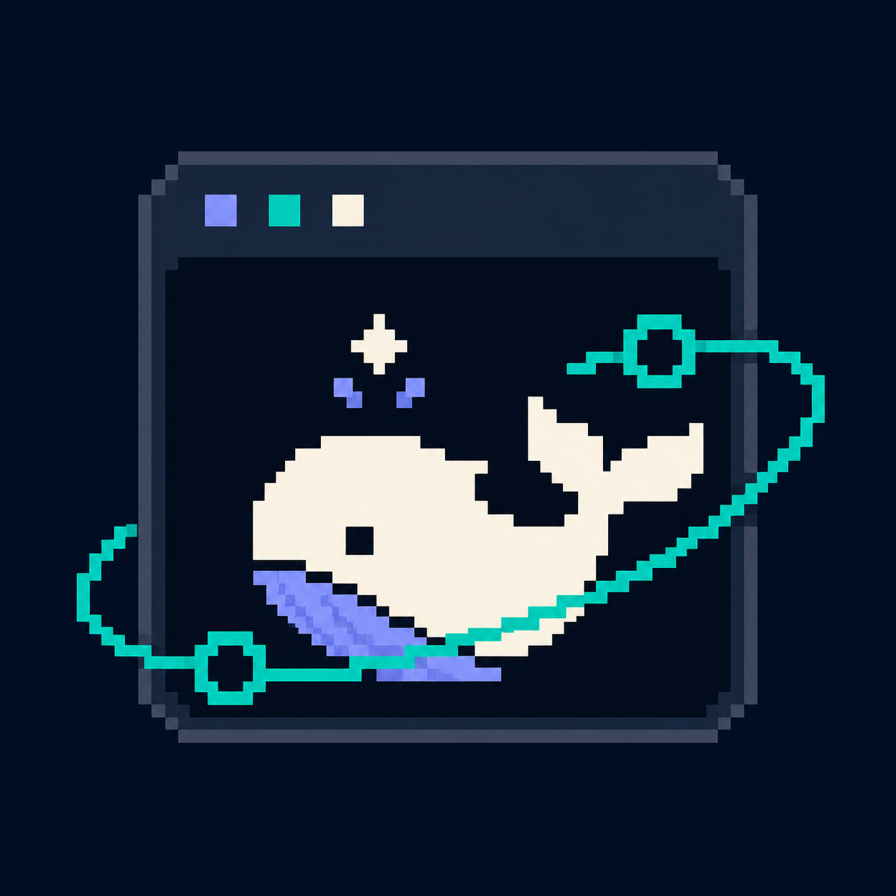
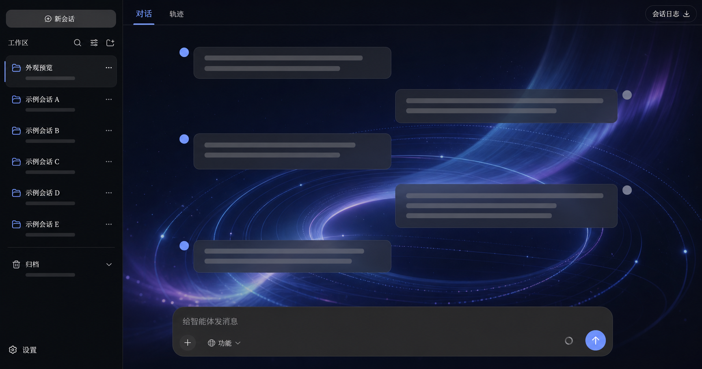
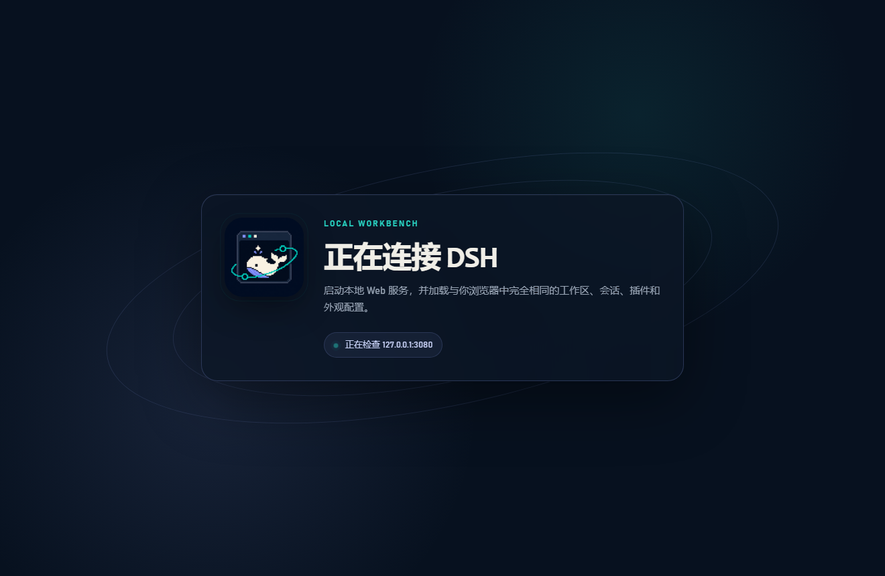
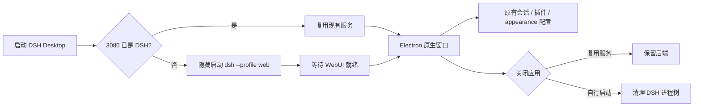

<div align="center">
  

# DSH Desktop

DeepSeek Harness WebUI 的轻量 Windows 桌面壳

[English](README.en.md) · [下载安装](#下载安装) · [工作原理](#工作原理) · [故障排查](#故障排查)

[](LICENSE)
[](#系统要求)
[](https://www.electronjs.org/)
</div>

DSH Desktop 把本机 DeepSeek Harness WebUI 放进独立的原生窗口：启动时连接或拉起 `dsh --profile web`，关闭时只清理由它启动的后端。它不复制聊天前端、不另建配置数据库，因此浏览器与桌面端看到的是同一套工作区、会话、插件、模型设置和 appearance 主题。

> [!IMPORTANT]
> 这是社区维护的桌面封装，不是 DeepSeek 官方桌面客户端。应用自身采用 MIT License；使用 DeepSeek Harness 时仍需遵循其项目说明和模型服务条款。



> 展示图使用通用占位会话并经过隐私化处理，不包含真实工作区、路径或聊天内容。应用运行时加载的是你本机实际的 DSH WebUI。

### 启动状态页



本地状态页只在连接期间或启动失败时出现。正常就绪后，同一个窗口会直接切换到 DSH WebUI；失败时则保留有界的诊断输出，不弹控制台也不修改配置。

## 为什么使用桌面壳

| 浏览器启动方式 | DSH Desktop |
| --- | --- |
| 需要手动启动后端并保留终端 | 后台隐藏启动，不弹出 CMD 窗口 |
| 需要自己打开并管理浏览器标签页 | 独立窗口、任务栏图标和开始菜单快捷方式 |
| 容易重复启动同一端口 | 启动前识别并复用现有 DSH WebUI |
| 关闭页面不等于关闭后端 | 只终止本应用自己创建的进程树 |
| 启动失败通常只剩终端错误 | 保留启动窗口并显示精简诊断 |

## 当前能力

- **真正复用现有服务**：先验证 `127.0.0.1:3080` 返回完整且结构有效的 DSH WebUI，再决定是否启动新后端。
- **冷启动缓存隔离**：原生窗口首次导航绕过旧的动态首页缓存，避免重启后把启动脚本或样式文本当作页面内容。
- **兼容官方 DSH**：缓存隔离与完整性检查全部由桌面壳完成，不要求修改、分叉或维护 DeepSeek Harness。
- **无 CMD 弹窗**：Windows 子进程使用 `windowsHide`，stdout/stderr 在内部收集用于错误诊断。
- **单实例**：再次启动会聚焦已有窗口，不会重复创建桌面壳。
- **生命周期所有权**：现有服务不会被接管或结束；应用自己启动的后端会在退出时清理。
- **原生快捷方式与图标**：NSIS 安装包为可执行文件、桌面快捷方式、开始菜单和卸载项配置同一图标。
- **WebUI 完全对齐**：对话、内容、插件、模型和外观仍由 DSH 本身提供。
- **轻量更新提醒**：WebUI 就绪后查询一次 GitHub Releases；仅发现更高稳定版时提示前往下载，不自动执行安装包。
- **安全窗口边界**：Node integration 关闭、context isolation 与 renderer sandbox 开启；外部链接交给系统浏览器。

## 系统要求

- Windows 10/11 x64；
- Node.js `22.19+` 或 `24+`（DeepSeek Harness 的运行要求）；
- 已安装 DeepSeek Harness，并且 `dsh --version` 可在新的 PowerShell 中运行；
- 可用的 `web` profile。首次执行 `dsh --profile web` 时 DSH 会初始化它；
- 默认监听地址 `http://127.0.0.1:3080`。

DSH Desktop 不打包 Node、模型密钥或 DSH home。它会直接使用你现有的 DSH 安装和 `$DSH_HOME`，不会迁移或复制会话。

官方发布的 DeepSeek Harness 无需额外补丁。即使 DSH 动态首页没有发送缓存控制响应头，DSH Desktop 也会使用独立探测和每次启动唯一的导航地址获取当前完整页面。

### 为什么依赖本机 Node 与 DSH

这是有意保留的运行环境边界，而不是缺失功能：

- `dsh` 本身是 Node.js 应用，应使用 DeepSeek Harness 支持的本机 Node 版本运行；Electron 内置的运行时只服务于桌面窗口，不替代外部 DSH CLI 的运行环境。
- 桌面端和浏览器连接同一个 DSH Host、同一个 `$DSH_HOME` 与同一个 WebUI，因此工作区、会话、插件、模型和 appearance 配置天然一致，不需要额外“同步”。
- 若在桌面壳中再捆绑一套独立 DSH，反而容易产生两套安装、两份 home、不同插件版本与配置漂移。

因此推荐先按 DeepSeek Harness 的要求安装 Node 和 DSH，再把 DSH Desktop 作为原生窗口入口。这样既保持 WebUI 的全部能力，也让命令行、浏览器和桌面端共享同一份真实数据。

## 下载安装

### 使用 Windows 安装包

从 [Releases](https://github.com/Zhen-WushuiLingchun/dsh-desktop-GUI/releases) 下载：

```text
DSH-Desktop-Setup-<version>.exe
```

安装器支持选择安装目录，并创建桌面与开始菜单快捷方式。当前社区构建未做商业代码签名，Windows SmartScreen 可能提示“未知发布者”；请只从本仓库 Release 下载并核对文件信息。

进入安装向导时，安装器会在隐藏窗口中执行一次 `dsh --version`。若 DSH 未安装、Node 环境不能运行 DSH，或安装器尚未读取到最新 PATH，会显示“中止 / 重试 / 忽略”提示：

- **中止**：退出安装，先配置 Node.js 与 DeepSeek Harness；
- **重试**：修复环境后重新检测；
- **忽略**：仅在确认 `dsh --version` 已能在新的 PowerShell 中运行时继续。

安装器不会自动安装或修改 Node、DSH、`$DSH_HOME`、模型密钥或会话。检测通过后可以在目录选择页面把 DSH Desktop 安装到有权限访问的任意本地磁盘和文件夹。

### 从源码运行

```powershell
git clone https://github.com/Zhen-WushuiLingchun/dsh-desktop-GUI.git
cd dsh-desktop-GUI
pnpm install
pnpm start
```

启动顺序：

1. 立即显示本地启动页；
2. 检查 `3080` 是否已经是一个有效 DSH WebUI；
3. 若没有，则在隐藏窗口中执行 `dsh --profile web`；
4. 等待包含有效 `window.__DSH_BOOT__`、完整 HTML 结构和挂载节点的 WebUI 文档；
5. 在同一原生窗口中载入 WebUI。

## 工作原理



核心逻辑只有 Electron main process 和一个本地启动/错误页面：

```text
src/main.js        服务探测、隐藏启动、窗口、安全导航和退出清理
src/update.js      GitHub Release 查询与语义版本比较
src/webui.js       完整页面校验与首次导航缓存隔离
src/startup.html   与 WebUI 配色一致的启动及故障状态页
assets/app-icon.png
                    安装包、快捷方式、窗口和 README 共用图标
```

## 与 appearance 插件的关系

DSH Desktop 不保存主题。`dsh-easy-appearance` 的颜色、背景图、透明度、字体和自定义 CSS 仍由 DSH Host settings 持久化到 `$DSH_HOME/settings.yaml`。桌面端载入同一个 loopback WebUI，所以刷新、浏览器访问和桌面启动会使用同一份配置。

appearance 插件仓库：[Zhen-WushuiLingchun/dsh-easy-appearance](https://github.com/Zhen-WushuiLingchun/dsh-easy-appearance)

## 本地构建安装包

```powershell
pnpm install
pnpm check
pnpm dist
```

产物：

```text
dist/DSH-Desktop-Setup-0.2.0.exe
dist/win-unpacked/DSH Desktop.exe
```

项目使用 `electron-builder` 的 NSIS 目标。`pnpm-workspace.yaml` 暂时把 `app-builder-lib` 请求的 `@electron/get@^3` 覆盖为 v4，因为 electron-builder 26.15.x 已引用 v4 才有的 `ElectronDownloadCacheMode`。

## 故障排查

### 提示找不到 `dsh`

在新的 PowerShell 中运行：

```powershell
dsh --version
```

若失败，先完成 DeepSeek Harness 安装并确保其命令目录进入用户或系统 PATH。安装器不会替你写入模型密钥或 DSH 配置。

### 一直停留在启动页

手动运行 `dsh --profile web` 查看 DSH 自身错误。常见原因包括 profile 配置错误、插件包未安装、端口冲突或 Node 版本不满足要求。桌面启动页会显示本次捕获到的后端输出尾部。

### 3080 被其他程序占用

应用只会复用包含 `window.__DSH_BOOT__` 标记的页面；普通 HTTP 服务不会被误认为 DSH。关闭占用 `3080` 的程序后重试。

### appearance 主题或背景没有恢复

确认 DSH WebUI 自身能在 `http://127.0.0.1:3080` 恢复主题，并检查 `$DSH_HOME/settings.yaml` 是否包含 `ui-appearance.config`。桌面壳不会维护第二份主题数据。

### 关闭窗口后 3080 仍在监听

如果启动应用前 DSH 已经运行，这是预期行为：桌面壳不会结束并非由它创建的服务。若由桌面壳启动，退出会调用隐藏的进程树清理。

## 设计边界与后续可选项

- 默认不内置或自动更新 DeepSeek Harness，以避免产生第二套 DSH 运行环境；
- 不打包 Node.js、模型服务或 API 密钥；
- 不提供远程地址/端口选择界面；
- 暂未做商业代码签名或应用内静默安装；
- 暂未持久化窗口尺寸和位置。

这些能力应保持可选，避免桌面壳演变成与 DSH 配置体系分叉的第二套产品。

## 隐私与安全

- DSH Desktop 只访问 loopback 地址 `127.0.0.1:3080`；
- 每次启动会向 GitHub Releases 发送一次不带身份凭据的版本查询，五秒超时；无新版本或网络失败时不提示；
- 不读取、上传或提交你的会话、设置和模型密钥；
- 外部 HTTP(S) 与邮件链接在系统浏览器/客户端中打开；
- 错误页面只显示本次后端进程输出的最后一段；
- 发布仓库不应包含 `$DSH_HOME`、日志、会话或本机路径。

## 许可证

[MIT License](LICENSE)。
